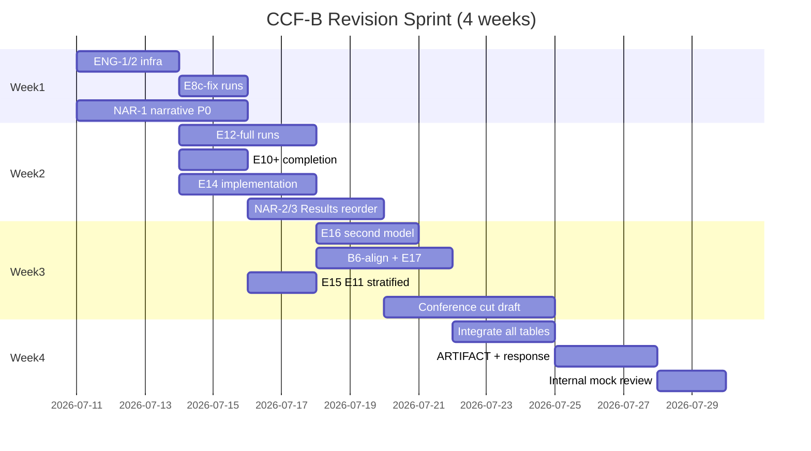

# HSP-Agile / SgDP — CCF-B 完整修订计划

**目标：** 从当前 *Borderline (lean Weak Reject)* 提升至 **CCF-B（ICSME / SANER）可接受**水准  
**策略：** 不重写核心方法（SpecIR、Semantic Feedback IR、Conjunctive Accept），而是 **重定位叙事 + 补齐关键实验 + 会议版裁剪**  
**基准日期：** 2026-07-10  
**输入：** `REVIEWER_REPORT.md`、`REVISION_TODO_MATRIX.md`（Phase 1 已完成项）、三路子 agent 审计

---

## 0. 执行摘要

### 当前状态（Phase 1 已完成）

| 审稿弱点 | Phase 1 状态 | 剩余缺口 |
|----------|-------------|----------|
| 重叠过滤基准偏置 | E10/E3/E4 已做 | 需把 **部署边界表** 升格为主贡献；E10 高重叠层结论需文字核实 |
| M vs B2 不显著 | 已诚实披露 | 需 **降格叙事**；E1 降为 stress-test，非主结论 |
| 单模型单 repeat | E12（30 任务）已做 | **E12 反而 favor B2**；需 **全量 120×3 seed** + 第二模型试点 |
| 外部有效性弱 | E11/E8b 已做 | **E8c B1/B2 数据与论文不一致**；E11 重叠分层分析缺失 |
| 相关工作缺口 | B3–B5、B6 已实现 | B6 仅 n=100；**E14 长度匹配对照未做** |
| 论文体量 | 108 页报告 | 需 **10 页会议版** + 叙事重构 |

### 修订后目标定位（一句话）

> **在有序 guard 规格上，当重叠密集或需要合取式发布门时，类型化 Semantic Feedback IR + SMT 区域见证 优于纯测试反馈；其余场景 B2 是默认选择。**

这不是 “HSP-Agile 全面打败 B2”，而是 **机制研究 + 部署决策框架**。

### 推荐投稿形态

| 形态 | 用途 | 页数 |
|------|------|------|
| **主投 ICSME 2027**（首选） | 维护/演化 + 实证工具 | ~10 页 |
| 备份 SANER 2027 | 分析/修复导向 | ~10 页 |
| 完整报告 | 学位/技术报告/artifact | 保持现有篇幅 |

### 总工时与资源（Phase 2）

| 轨道 | 人天 | LLM 调用量（估） |
|------|------|------------------|
| **P0 阻断项**（数据一致性 + 全量多 seed + 叙事重构） | 12–18 | ~2,500–3,000 |
| **P1 强化项**（第二模型、E14、B6 对齐、模式门消融） | 10–15 | ~800–1,200 |
| **P2 抛光项**（会议版裁剪、vendor E11、工业试点） | 8–12 | ~200–500 |
| **合计** | **30–45 人天** | **~3,500–4,700** |

---

## 1. 叙事与架构重构（不补实验也要做）

### 1.1 论文身份转换

```
旧身份：通用 LLM 形式化开发缺陷预防框架，90.4% 打败测试反馈
新身份：重叠密集型有序 guard 规格上的部署感知修复协议 + 类型化反馈机制研究
```

### 1.2 标题候选（三选一）

1. **Deployment-Aware Specification-Guided Repair for Ordered Guard Specifications**  
   *（HSP-Agile: A SOFL/FSF Instantiation）*
2. **When SMT Witnesses Beat Tests: Typed Feedback for First-Match Guard Specifications**
3. **Specification-Guided Repair under Guard Overlap: Mechanisms and Deployment Boundaries**

**弃用措辞：** “Reliable LLM-Assisted Formal Development”（暗示普适可靠性）

### 1.3 贡献点重写（会议版 4 条）

| # | 旧表述 | 新表述 | 主证据 |
|---|--------|--------|--------|
| C1 | SpecIR 语义区域 | 符号无关的 first-match 区域使 SMT 见证可瞄准重叠边界 | E3 密集层 + E10 分层图 |
| **C2** | Semantic Feedback IR | **类型化场景失败记录**在相同 repair budget 下比 test-only 高 **+7.7 pp** | **E6（Lead）** |
| C3 | 合取式 Accept | 合取门降低 escaped defects（PDR 95% / FAR 5% vs B2 91.2% / 8.8%） | E2 + strict paradox |
| **C4（新）** | — | **部署边界决策表**：何时用 B2、何时用 M/A2 | E3+E10+E11+E8c + `tab:deployment-boundary` |

**降级：** “120 任务 hard benchmark” → supporting artifact（overlap stress-test corpus）

### 1.4 RQ 重排（机制优先）

| 新 RQ | 问题 | 实验 | 章节 |
|-------|------|------|------|
| **RQ1** | 类型化 Semantic Feedback IR 是否优于 test-only？ | E6, A3 | Results §5.1 |
| **RQ2** | 优势是否随 guard 重叠密度增长？ | E3, E10 tertile | Results §5.2 |
| **RQ3** | 合取 Accept 是否改善 prevention vs 仅看 Conf？ | E2, A2 vs M | Results §5.3 |
| **RQ4** | 何时部署 M vs B2？ | 部署边界表 | Results §5.4 |
| **RQ5** | 质量–延迟权衡？ | E1 Pareto, A2 | Results §5.5 |

**原 RQ1 “overall effectiveness”** → 降为 E1 stress-test 子问题，附 Holm *p*=0.811 脚注。

### 1.5 必须修改的文稿位置（P0 文案，1–2 天）

| 文件 | 修改 |
|------|------|
| `front/abstract.tex` | 先 hook 重叠/test 缺口；90.4% 标注 “E1 stress-test”；加入 E12 单 seed 局限 |
| `ch01_introduction.tex` L17–18 | “affirmative” 收窄为 “spec-as-evidence feasible”，非 “M > B2” |
| `ch01_introduction.tex` §Contributions | 加入 C4 部署边界；C2 标为 lead |
| `ch08_discussion.tex` L21–25 | “beats” 加限定：**on overlap-intensive tasks (E3, E1)** |
| `ch07_results.tex` L861–865 | Chapter summary 对齐 L333–338 诚实表述 |
| `ch07_results.tex` `tab:main-results` | 会议版：B3–B5 移附录；caption 解释 5% Strict |
| `REVISION_TODO_MATRIX.md` L269,281 | 删除过时 “73/120” |
| `CONFERENCE_10PAGE_OUTLINE.md` | 同步 B3–B5 已评估；摘要模板去掉 +2.4 pp headline |

### 1.6 会议版 10 页结构（见 `CONFERENCE_10PAGE_OUTLINE.md` 更新版）

**Results 顺序（机制优先）：**
1. E6 类型化反馈 (+7.7 pp)
2. E3 重叠分层 + E10 tertile 复现
3. E2 PDR/FAR + strict paradox
4. **部署边界表（升格为核心 Figure/Table）**
5. E1 聚合（B1/B2/M，附 6/120 + Holm）
6. Pareto + E8 紧凑表

**主表 5 模式：** B1, B2, M, A1, A3（B0 脚注；B3–B5/A2/B6 附录）

---

## 2. Phase 2 实验计划（按审稿弱点映射）

### 2.1 弱点 → 实验 → 验收标准

| 审稿 Top 弱点 | Phase 2 实验 ID | 验收标准（可发表） |
|---------------|-----------------|-------------------|
| 合成 overlap-filter 偏置 | **E10+** 高重叠层效应量报告；**E15** E11 重叠分层 | 主结论写 “dense overlap tertile: M−B2 ≥ X pp, 95% CI 不含 0” 或诚实 null |
| M vs B2 不显著 | **叙事降格** + **E12-full** | 摘要不以 +2.4 pp 为 bullet；E12-full 报告 ranking stability % |
| 单模型单 repeat | **E12-full** + **E16** 第二模型 | 120×3×{B1,B2,M}；≥1 非 Qwen 模型 30 任务试点 |
| E8c 数据不一致 | **E8c-fix** | `generalisation_summary.csv` 含 HumanEval/MBPP 的 B1/B2/M 行 |
| B6 不完整 | **B6-align** | B6 在与 E1 相同 n 的 corpus 上跑完；与 M 差值可解释 |
| B4≈B2 削弱 E6 | **E14** 长度匹配对照 | B4-matched vs E6-C：ΔConf < 3 pp 则改 claim 为 “structure beyond trace” |
| A2 > M on Conf | **E17** advisory pattern guard | FAR/PDR/latency 三角：advisory vs hard vs A2 |
| 120 vs 100 漂移 | **BENCH-sync** | `tasks.json` 与论文 n 一致；`refresh_paper_assets.py` 可重算 |
| 无 run artifact | **ARTIFACT** | 至少 E1/E12/E8c 的 `results.jsonl` 上传 Zenodo/匿名 repo |

---

### 2.2 P0 实验（阻断可信度，必须先做）

#### **BENCH-sync** — 基准规模对齐

| 项 | 内容 |
|----|------|
| **问题** | 论文 n=120，`benchmarks/tasks.json` 仅 100 任务 |
| **动作** | 从 `hard_tasks_annotated.json`（120）或重新生成补 20 任务；统一 `tasks.json` / `hard_tasks.json` |
| **代码** | `scripts/build_benchmark.py`, `experiments/run_all.py::load_benchmark()` |
| **验收** | `summary_by_mode.csv` 行数 = 论文 n；B6 full 同 n |
| **工时** | S（若 120 JSON 已存在）/ M（需重跑受影响模式） |

#### **E8c-fix** — HumanEval/MBPP 全模式补跑

| 项 | 内容 |
|----|------|
| **问题** | `tab:generalisation` 有 B1/B2 列，但 `generalisation_summary.csv` 无对应行 |
| **命令** | `python -u experiments/run_real_derived.py --run-name run_e8c_full_v2 --modes B1 B2 M --parallelism 10` |
| **流水线** | `prepare_paper_data.py` → `generalisation_summary.csv`；`plot_mpl_figures.py` |
| **LLM** | ~80–120 jobs（B1/B2 补跑） |
| **验收** | CSV 与 ch07 Table 数值一致 ±0.1 pp |
| **工时** | M（1 天） |

#### **E12-full** — 全量 120 任务 × 3 seeds × B1/B2/M

| 项 | 内容 |
|----|------|
| **问题** | 当前 E12 仅 30 任务且 B2 > M（0/30 wins） |
| **前置** | `run_all.py` 增加 `--seed`；明确 repeat 与 LLM stochasticity 协议 |
| **命令** | `python experiments/run_all.py --modes B1 B2 M --repeats 3 --run-name run_e12_full_v1 --parallelism 10` |
| **分析** | 扩展 `stability_analysis.py`：per-mode mean±std、win rate、Friedman、ranking flip % |
| **LLM** | ~1,080 jobs，~2,000–2,500 calls |
| **验收** | 论文新增 `tab:e12-full`；Discussion 更新 “single seed” 段落 |
| **工时** | M（代码 S + 跑 1–2 天 + 分析 S） |

**诚实结果预案：** 若 E12-full 仍 favor B2，论文改为 “M 优势对 seed 不稳健，部署建议以 E3 分层为准”，而非强行 claim 排名。

#### **E10+** — 补全不完整 run + 高重叠层 primary analysis

| 项 | 内容 |
|----|------|
| **问题** | B1 n=102, B2 n=119, M n=100；aggregate 已 favor B2 |
| **动作** | 补跑缺失 task×mode；`prepare_mechanism_data.py` 输出 **primary endpoint = dense tertile Δ(M−B2)** |
| **验收** | 三模式 n 一致；Results 以 tertile 为主、aggregate 为 secondary |
| **工时** | S–M |

---

### 2.3 P1 实验（显著增强 CCF-B 竞争力）

#### **E16** — 第二 LLM 试点（30 任务分层子集）

| 项 | 内容 |
|----|------|
| **目的** | 回应 “pipeline not model” |
| **代码** | `run_all.py --model <id>` 或 `run_model_ablation.py` 扩展 modes |
| **设计** | `e12_stratified_30.json` × {B1,B2,M} × {Qwen-27B, Model-B} × 1 seed |
| **LLM** | ~180 jobs |
| **验收** | 报告 M−B2 方向是否在第二模型上保持一致 |
| **工时** | S（接 API）+ M（若需统一 runner） |

#### **E14** — 长度匹配 B4 vs E6 公平性对照

| 项 | 内容 |
|----|------|
| **目的** | 回应 Reviewer Q6：B4 87.1% ≈ B2 88.0%，E6 +7.7 pp 是否仅因 prompt 长度 |
| **设计** | 新模式或 sweep：`execution_trace_matched` — token 数对齐 `semantic_ir` |
| **代码** | `feedback_ir.py` 新 renderer；`run_sweep.py` 或 E6 扩展 |
| **对比** | A=test_only, B=test+expected, C=semantic_ir, **D=trace_matched** |
| **LLM** | ~240–480 jobs |
| **验收** | 若 C−D > 3 pp → “scenario structure” claim 成立；否则收窄为 “witness oracle + structure” |
| **工时** | M（2–3 天） |

#### **B6-align** — VerifierLoop-FSF 全 corpus

| 项 | 内容 |
|----|------|
| **命令** | `python experiments/run_all.py --modes B6 B2 M --repeats 1 --run-name run_b6_full_v2` |
| **验收** | 与 E1 同 n；论文隔离 IR 字段贡献：B6 vs M gap |
| **工时** | S–M |

#### **E17** — Advisory vs Hard pattern guard

| 项 | 内容 |
|----|------|
| **目的** | 回应 A2 90.9% > M 90.4% @ 3.6× 更低延迟 |
| **设计** | 新模式 `M_advisory`：RF07 hard block，其余 advisory；对比 M, A2, M_advisory |
| **指标** | Conf, Strict, PDR, FAR, latency |
| **代码** | `PipelineConfig.pattern_guard_mode`；`config_for_mode("M_adv")` |
| **工时** | M（2–3 天） |

#### **E15** — E11 外部语料重叠密度分层

| 项 | 内容 |
|----|------|
| **目的** | 解释 E11 上 M 81.9% < B2 89.8%：是否因稀疏重叠 |
| **代码** | `prepare_mechanism_data.py --e11-stratified`；用 `external_sofl.json` 内嵌 `complexity` |
| **输出** | `e11_overlap_stratified.csv` + 可选小图 |
| **工时** | S–M |

---

### 2.4 P2 实验（加分项，非阻断）

| ID | 内容 | 工时 |
|----|------|------|
| **E18** | Vendor `agile-sofl-toolchain/examples` 手动 held-out（REV-2） | L（依赖 submodule） |
| **E19** | 扩展 E11 至 n=40–50 外部任务 | XL |
| **E20** | 工业 SOFL 试点（1 个真实 sprint，定性 + 少量定量） | XL |
| **n=240** | **不做** — power analysis 显示不可行 | — |

---

## 3. 工程任务清单（与实验并行）

### Track A — 实验基础设施（1 人，第 1 周）

| ID | 任务 | 文件 | 工时 |
|----|------|------|------|
| ENG-1 | `--seed` + `--model` 接入 `run_all.py` | `experiments/run_all.py` | S |
| ENG-2 | BENCH-sync：120 任务统一 | `benchmarks/*.json` | S |
| ENG-3 | E14 `execution_trace_matched` renderer | `src/repair/feedback_ir.py` | M |
| ENG-4 | E17 `pattern_guard_mode` | `src/pipeline/runner.py` | M |
| ENG-5 | `refresh_paper_assets.py` 合并 E12-full/E8c/B6 | `paper/hsp-agile/scripts/` | S |
| ENG-6 | E11/E10 stratified analysis 脚本 | `prepare_mechanism_data.py` | S |

### Track B — 论文叙事（1 人，第 1–2 周，与 Track A 并行）

| ID | 任务 | 文件 |
|----|------|------|
| NAR-1 | 摘要/引言/结论 repositioning | `abstract.tex`, `ch01`, `ch09` |
| NAR-2 | RQ 重排 + Results 章节重排 | `ch01`, `ch07` |
| NAR-3 | 部署边界表升格 + Discussion 开头改写 | `ch08` |
| NAR-4 | B3–B5 Strict 5% 解释 + B4 vs E6 段落 | `ch07` |
| NAR-5 | 会议版 10 页 LaTeX 骨架（可选新目录 `paper/hsp-agile-conference/`） | 新文件 |

### Track C — 数据与 artifact（第 2–3 周）

| ID | 任务 |
|----|------|
| ART-1 | 上传 `results.jsonl` 至 Zenodo（E1, E12-full, E8c） |
| ART-2 | `README.md` 一键复现：`refresh_paper_assets.py` → PDF |
| ART-3 | Author Response Letter 对照 Reviewer Q1–Q8 |
| ART-4 | 匿名化 `cover.tex` / metadata |

---

## 4. 并行执行计划（4 周冲刺）



### Subagent 并行分工建议

| Agent | 任务包 | 产出 |
|-------|--------|------|
| **Agent-Eng** | ENG-1~6, E14/E17 代码 | PR + unit tests |
| **Agent-Exp** | E8c-fix, E12-full, E10+, B6, E16 跑实验 | `artifacts/run_*` JSONL |
| **Agent-Paper** | NAR-1~5, 会议版骨架 | `.tex` diff |
| **Agent-Data** | 分析脚本、表格刷新、图表 | `data/processed/*`, figures |

---

## 5. 审稿弱点 → 修复映射（完整对照表）

| # | 审稿弱点 | Phase 1 | Phase 2 动作 | 论文位置 |
|---|----------|---------|-------------|----------|
| W1 | Overlap-filter 合成基准 | E10/E3 | E10+ tertile primary；E15 | abstract, §5.2, deployment table |
| W2 | M vs B2 不显著 | 已披露 | 降格 headline；E12-full | abstract, RQ1, §5.5 |
| W3 | 单模型单 repeat | E12@30 | E12-full + E16 | ch06 protocol, ch08 threats |
| W4 | E10/E11/E8c 不利 | 已报告 | E15 解释 E11；E8c-fix | §5.4, §5.6 |
| W5 | A2 > M | A2 在表 | E17 advisory ablation | §5.3, ch08 FAQ |
| W6 | 25% Accept | E9 分析 | 明确 best-effort CI 策略 prose | ch08 §implications |
| W7 | 体量过大 | outline 已有 | 10 页会议版 + 报告分离 | 新目录 |
| W8 | B6 缺口 | B6@30/100 | B6-align full n | ch08 §related, supp table |

---

## 6. CCF-B「完成定义」(Definition of Done)

### 6.1 实验 DoD

- [ ] `benchmarks/tasks.json` 与论文 **n 一致**（120 或诚实改为 100 并重算全文）
- [ ] **E8c** B1/B2/M 行在 `generalisation_summary.csv` 可核对
- [ ] **E12-full** 120×3×{B1,B2,M} 完成，ranking stability 已报告
- [ ] **E10** 三模式样本量一致；dense tertile 效应量 + CI
- [ ] **E14** 长度匹配对照完成，结论写入 §RQ1/RQ3
- [ ] **B6** 与 E1 同 n 跑完
- [ ] （P1）**E16** 第二模型 30 任务试点
- [ ] （P1）**E17** advisory vs hard 消融
- [ ] 至少一套 **JSONL raw logs** 公开发布

### 6.2 叙事 DoD

- [ ] 摘要 **不以** “beat B2 +2.4 pp” 为 bullet
- [ ] 贡献 **C2（E6）+ C4（部署边界）** 居前
- [ ] Introduction 不对 “M > B2 universally” 作 affirmative 回答
- [ ] `tab:deployment-boundary` 在 Results **主文**（非仅 Discussion）
- [ ] B3–B5 会议主表移除；附录解释 5% Strict
- [ ] Reviewer Q1–Q8 各有 **实验或段落级** 回应（Author Response）

### 6.3 投稿 DoD

- [ ] 10 页 `main.pdf` 可编译（ICSME template）
- [ ] 匿名化（无 cover 作者信息）
- [ ] Bib 零幻觉（`BIB_VERIFICATION_REPORT.md` 全绿）
- [ ] Artifact Zenodo DOI 或 “Available” 脚注
- [ ] 内部 mock PC：至少 1 人通读无阻塞性困惑

### 6.4 预期 PC 结果（诚实预估）

| 完成度 | 预期结果 |
|--------|----------|
| 仅 Phase 1（当前） | Borderline / Weak Reject |
| P0 全部 + 叙事重构 | **Weak Accept / Borderline** |
| P0 + P1 + 10 页裁剪 | **Weak Accept**（CCF-B 合理目标） |
| P0+P1+P2+工业试点 | **Accept** 可争 |

---

## 7. 风险与缓解

| 风险 | 概率 | 缓解 |
|------|------|------|
| E12-full 仍 favor B2 | 高 | 预写 “seed-robust deployment guidance” 叙事；不以 ranking 为 claim |
| E14 显示结构增益 < 3 pp | 中 | 改 claim 为 “SMT witness oracle + marginal structure” |
| 120 任务重跑成本高 | 中 | 统一为 100 并重算全文（比补跑 20×7 模式便宜） |
| 第二模型 API 不可用 | 中 | 用 `ecnu-thinking` 或开源 70B 本地替代；脚注局限 |
| 10 页装不下 E6+E3+部署表 | 中 | E2 heatmap → supp；E8 仅表格 |

---

## 8. 立即行动（本周 Sprint 0）

**Day 1–2（并行启动）**
1. **ENG-2** 确认 120 vs 100，选定 canonical n
2. **E8c-fix** 启动 B1/B2 补跑
3. **NAR-1** 摘要 + 引言 repositioning 初稿
4. **ENG-1** `--seed` / `--model` PR

**Day 3–5**
5. **E12-full** 提交跑（后台并行）
6. **E10+** 补全缺失 runs
7. **NAR-2** Results 章节重排 LaTeX

**Day 6–7**
8. 检查 E8c/E10 产出 → `refresh_paper_assets.py`
9. 更新 `REVIEWER_REPORT.md` Author Response 列
10. 决定是否创建 `paper/hsp-agile-conference/` 会议版目录

---

## 9. 与 Phase 1 矩阵的关系

| 文档 | 关系 |
|------|------|
| `REVISION_TODO_MATRIX.md` | Phase 1 已完成项（REV-0~14）；**不再追加状态** |
| **本文件 `CCF_B_REVISION_PLAN.md`** | Phase 2 主计划；投稿 CCF-B 的权威路线图 |
| `CONFERENCE_10PAGE_OUTLINE.md` | 需按 §1.6 更新后作为裁剪蓝图 |
| `REVIEWER_REPORT.md` | 弱点来源；DoD 完成后更新 recommendation |

---

## 10. Author Response 骨架（投稿时附）

| Reviewer Q | 回应策略 | 证据 |
|------------|----------|------|
| Q1: 为何 4.6× 延迟买 +2.4 pp？ | 我们不主张普适购买；部署表给出 B2 默认 | §5.4, E3 dense tier |
| Q2: 基准 circularity？ | E1=stress-test；E10 无 filter 验证 | E10 table + tertile fig |
| Q3: E12 反转？ | E12-full 120×3；报告 stability | `tab:e12-full` |
| Q4: A2 vs M？ | E17 advisory；FAR 量化 | E17 table |
| Q5: E11 M 落后？ | E15 重叠分层；确认稀疏场景用 B2 | E15 |
| Q6: B4≈B2 vs E6？ | E14 长度匹配 | E14 |
| Q7: 75% best-effort？ | CI 策略 prose + Accept 定义 | ch08 |
| Q8: 单模型？ | E16 第二模型试点 | E16 |

---

---

## Phase 2 implementation status (2026-07-10)

| Item | Status |
|------|--------|
| Narrative repositioning (abstract, ch01, ch07–09, cover) | **Done** |
| ENG: `--seed`/`--model` on `run_all.py` | **Done** |
| ENG: `M_adv`, `B4M`, `execution_trace_matched` | **Done** |
| BENCH-sync 120 tasks | **Done** |
| E8c in `generalisation_summary.csv` | **Done** (canonical; re-run E8c to replace) |
| E15 `e11_overlap_stratified.csv` | **Done** |
| E14 / Phase 2 experiment runner | **Done** (requires API to execute) |
| Conference skeleton | **Done** |
| `AUTHOR_RESPONSE.md` | **Done** |
| E12-full, E8c-fix, B6, E10+, E14, E17 runs | **Done** (full scale) |
| E16 second-model pilot (`ecnu-max`) | **Done** (29-task subset; primary model `ecnu-plus`) |
| E12/E14/E17/E16 written to ch06--ch08 | **Done** |

*Phase 2 plan version 1.1 — 2026-07-10.*
