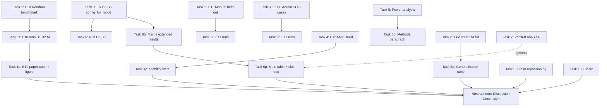

# HSP-Agile Revision TODO Matrix

**Goal:** Enhance **claim credibility** without changing core method (SpecIR, Semantic Feedback IR, Conjunctive Acceptance).

**Principles (from revision plan):**
- Do **not** modify algorithm / framework design.
- Add experiments, adjust claims, reorganize narrative.
- Reposition from “universal outperform B2 (+2.4 pp)” → “overlap-intensive specs + structured semantic feedback + safety-oriented release.”

**Inputs:** `REVIEWER_REPORT.md`, `BIB_VERIFICATION_REPORT.md`, `CONFERENCE_10PAGE_OUTLINE.md`, `RUN_B3_B5_PROTOCOL.md`

**Legend:**
| Field | Meaning |
|-------|---------|
| **P** | Priority: P0 = blocking credibility, P1 = high, P2 = medium, P3 = polish |
| **Effort** | S / M / L / XL (person-days, rough) |
| **Deps** | Must complete before this task |

---

## Executive dependency graph

**Recommended sprint order:** Task 0 → Task 6/6b → Task 1 → Task 4 → Task 8 → Task 9 → Task 10 → Task 2/3 → Task 5 → Task 7 (optional)

---

## Stage 0 — Engineering prerequisites (do before any new claims)

### Task 0 — Implement B3/B4/B5 in `config_for_mode`

| Dimension | Detail |
|-----------|--------|
| **ID** | `REV-0` |
| **P** | **P0** |
| **Problem** | `src/pipeline/runner.py::config_for_mode()` has **no branches for B3, B4, B5**. They inherit default `PipelineConfig` (= full M-like: formal + patterns + repair). Extended run artefacts are **invalid** until fixed. |
| **Code modules** | `src/pipeline/runner.py` (add B3/B4/B5), possibly `src/repair/` (self-critique / trace templates), `tests/test_config_modes.py` (new) |
| **Spec** | B3: `enable_formal=False`, `enable_patterns=False`, `enable_repair=True`, `feedback_variant=self_critique` (new or reuse prompt path). B4: test execution trace feedback, no Z3 IR. B5: Reflexion-lite verbal memory, equal `max_attempts=3`, equal token cap per call. |
| **Experiments** | Re-run smoke: `python experiments/run_all.py --modes B3 B4 B5 --task-limit 3 --repeats 1 --run-name run_b345_smoke_v2` |
| **Acceptance** | Unit test asserts B3≠M config; smoke JSONL shows distinct `attempt_history` / feedback fields vs B2 and M. |
| **Effort** | **M** (1–2 days) |
| **Deps** | None |
| **Paper** | None until Task 6 complete |

---

## Stage 1 — Benchmark validity (Reviewer concern A)

### Task 1 — E10: Random FSF Benchmark (uniform sampling)

| Dimension | Detail |
|-----------|--------|
| **ID** | `REV-1` |
| **P** | **P0** |
| **Problem** | Current 120-task set uses overlap-biased Z3 filter (`scripts/build_benchmark.py::_z3_satisfiability_filter`). Reviewer: “only proves method on author-constructed overlap-heavy set.” |
| **Code modules** | `scripts/build_benchmark.py` (already has `--no-filter`), `src/benchmarks/hard_gen.py`, `src/benchmarks/complexity.py`, **new:** `scripts/build_random_benchmark.py` or extend `build_benchmark.py` with `--random-size 100 --uniform-metadata` |
| **Experiment** | **E10** — Generate **100 tasks**: `python scripts/build_benchmark.py --hard-size 150 --hard-limit 100 --no-filter --annotate --annotated-path benchmarks/random_tasks_annotated.json` |
| **Runs** | `python experiments/run_all.py --modes B1 B2 M --repeats 1 --benchmark benchmarks/random_tasks_annotated.json --run-name run_e10_random_v1` (may need CLI flag to load custom benchmark — **gap: `run_all.py` uses `load_benchmark()` only**) |
| **New code gap** | Add `--benchmark-path` to `experiments/run_all.py` and `load_benchmark(path=...)` |
| **Stats / outputs** | `data/processed/e10_random_summary.csv`; per-task overlap_rate from `complexity.py`; stratified analysis by tertile |
| **Figures** | **Fig E10:** `performance_vs_overlap.pdf` — x=overlap_rate, y=Conf, lines B1/B2/M (+ bootstrap CI bands). Generator: extend `plot_mpl_figures.py` |
| **Tables** | **Table E10:** Random benchmark results (B1/B2/M × Conf/Strict/Latency); **Table E10-meta:** overlap/boundary/arithmetic/scenario-count distributions |
| **Paper chapters** | `ch06` new §E10 protocol; `ch07` new §E10 results; `ch08` §generalisation boundaries; `abstract`, `intro`, `conclusion` — reposition claim |
| **Acceptance** | Show M≈B2 at low overlap, M>B2 at high overlap (or honest null if not); **do not** claim universal win on random set |
| **Effort** | **L** (3–4 days: benchmark + runner flag + runs + plots) |
| **Deps** | None (parallel with Task 0) |
| **Est. LLM cost** | 100 tasks × 3 modes × ~2 calls ≈ 600 calls (~similar fraction of E1) |

### Task 1r — E10 experiment execution

| Dimension | Detail |
|-----------|--------|
| **ID** | `REV-1r` |
| **P** | P0 |
| **Deps** | REV-1 benchmark file + `--benchmark-path` |
| **Command template** | See Task 1 |
| **Artifact** | `artifacts/run_e10_random_v1/results.jsonl` |
| **Pipeline** | Extend `prepare_paper_data.py` with `--e10-run-dir` → `e10_random_summary.csv` |

### Task 1p — E10 paper integration

| Dimension | Detail |
|-----------|--------|
| **ID** | `REV-1p` |
| **Paper** | `ch06_experimental_setup.tex`, `ch07_results.tex`, `ch08_discussion.tex`, `ch01_introduction.tex` (contributions footnote), `front/abstract.tex` |
| **Claim text** | Replace “outperform B2” with “advantage concentrates in overlap-intensive specifications (E3, E10).” |

---

### Task 2 — E11: Held-out manual / example tasks

| Dimension | Detail |
|-----------|--------|
| **ID** | `REV-2` |
| **P** | **P1** |
| **Problem** | Paper cites ~20 base tasks excluded from eval; need **held-out** run without re-filtering. |
| **Code modules** | `src/asfl_bridge.py::collect_tasks_from_examples()` → `vendor/agile-sofl-toolchain/examples/*.asfl`; `src/benchmarks/references.py`; `scripts/build_benchmark.py::build_benchmark(min_scenarios=...)` |
| **Gap** | Verify `vendor/agile-sofl-toolchain/examples` exists in repo; if missing, submodule init or manual JSON export |
| **Experiment** | **E11a** — Export manual suite: `python scripts/build_benchmark.py` (base only) → `benchmarks/manual_heldout.json`; **exclude** any task ID in `hard_tasks.json` |
| **Runs** | B1, B2, M on full held-out set; `run-name run_e11_manual_v1` |
| **Outputs** | Table: Manual benchmark (n=?); figure optional (small n) |
| **Paper** | `ch06` §benchmark: clarify train/eval split; `ch07` E11 subsection; `app_b_benchmark.tex` |
| **Acceptance** | Zero overlap of task IDs with E1 120; document provenance per task |
| **Effort** | **M–L** (2–3 days; depends on example availability) |
| **Deps** | Vendor examples present |

---

### Task 3 — E11b: External / textbook SOFL cases

| Dimension | Detail |
|-----------|--------|
| **ID** | `REV-3` |
| **P** | **P1** |
| **Problem** | No non-author external FSF corpus in eval. |
| **Code modules** | Manual curation → `benchmarks/external_sofl.json`; `liu2014sofl` / Agile-SOFL textbook cases (after bib fix) |
| **Experiment** | **E11b** — Target 20–30 tasks from Liu SOFL book / Agile-SOFL papers / IET RF pattern examples; hand-convert to FSF JSON |
| **Runs** | B1, B2, M |
| **Outputs** | Table + source appendix table (case name, book section, overlap tier) |
| **Paper** | `ch06`, `ch07`, `app_b_benchmark.tex` |
| **Acceptance** | Each task has citable external source; not generated by `hard_gen.py` |
| **Effort** | **XL** (5–10 days manual curation + runs) — can parallelize with coding |
| **Deps** | Bib corrections for SOFL lineage (REV-10) |

---

## Stage 2 — Statistical credibility (Reviewer concern B)

### Task 4 — E12: Multi-seed stability analysis

| Dimension | Detail |
|-----------|--------|
| **ID** | `REV-4` |
| **P** | **P0** |
| **Problem** | E1 single repeat (`repeat=0`); Reviewer rejects single-seed LLM stability. |
| **Code modules** | `experiments/run_all.py` (`--repeats`, `--task-limit`), **new:** `scripts/select_stratified_subset.py` (30 tasks: easy/med/hard × overlap tertiles), `paper/hsp-agile/scripts/stability_analysis.py` |
| **Experiment** | **E12** — 30 stratified tasks × seeds {0,1,2} × modes {B2, M}; fixed `T_gen`, `T_repair` |
| **Runs** | `python experiments/run_all.py --modes B2 M --repeats 3 --task-limit 30 --task-subset benchmarks/e12_stratified_30.json --run-name run_e12_stability_v1` (subset selector **new**) |
| **Stats** | Per-mode: mean, std, 95% CI (across seeds), **win rate** M vs B2 per task, Friedman test across seeds, ranking stability % |
| **Figures** | Boxplot/violin: `e12_stability_violin.pdf`; win-rate bar with CI |
| **Tables** | `tab:e12-stability` |
| **Paper** | `ch06` §statistical protocol; `ch07` §E12; `ch08` threats (internal validity) |
| **Acceptance** | Report whether M/B2 **ranking** flips across seeds; honest if unstable |
| **Effort** | **M** (2 days code + 1 day runs) |
| **Deps** | `hard_tasks_annotated.json` for stratification labels |
| **Est. cost** | 30×2×3 = 180 jobs |

### Task 5 — Power analysis & optional n=240 extension

| Dimension | Detail |
|-----------|--------|
| **ID** | `REV-5` |
| **P** | **P1** |
| **Problem** | Reviewer asks why n=120; M vs B2 Holm p=0.811, δ≈0. |
| **Code modules** | **New:** `paper/hsp-agile/scripts/power_analysis.py` (statsmodels or manual: paired Wilcoxon power, Cliff's δ); `update_stats_table.py` |
| **Analysis** | Post-hoc power for observed δ=0.0002 (M vs B2) and δ=0.036 (M vs B1); report n needed for 80% power at α=0.05 |
| **Optional experiment** | Duplicate E1 to **n=240** random tasks (E10-style uniform + hard mix) — **only if power calc says feasible** |
| **Paper** | `ch06` §statistical protocol (new subsection); `ch07` stats summary; `ch08` conclusion validity |
| **Acceptance** | One paragraph: “n=120 is powered for M vs B1 (marginal) but not M vs B2”; justify not extending OR report extended run |
| **Effort** | **S** (analysis only) / **XL** (if n=240 rerun) |
| **Deps** | REV-1 or existing `significance_tests.json` |

---

## Stage 3 — Competitive baselines (Reviewer concern C)

### Task 6 — Run B3, B4, B5 (full or stratified 30)

| Dimension | Detail |
|-----------|--------|
| **ID** | `REV-6` |
| **P** | **P0** |
| **Problem** | Related work cites Self-Refine / Self-Debug / Reflexion but E1 table omitted them. |
| **Code modules** | **REV-0 first**; `experiments/run_all.py`; `RUN_B3_B5_PROTOCOL.md` |
| **Existing state** | Protocol doc claims `run_ccf_b_extended_v1` complete (1080 jobs) — **must re-validate after REV-0**; merge via `prepare_paper_data.py --extended-run-dir` |
| **Experiment** | **E1-ext** — Minimum: 30-task stratified (same as E12); Ideal: full 120 × 3 repeats |
| **Runs** | Full: see `RUN_B3_B5_PROTOCOL.md`; Stratified fallback: `--task-limit 30` + subset file |
| **Outputs** | Extend `summary_by_mode.csv`; `tab:main-results` add B3–B5 rows; Holm tests incl. B4 vs M |
| **Paper** | `ch06` tab:modes (un-mark “planned”); `ch07` main table + prose; `ch02` related work |
| **Acceptance** | Equal K=3, same model, same prompt token budget; M > B3/B5 on Conf; compare B4 vs B2 fairly |
| **Effort** | **S** (merge only if REV-0 confirms old runs invalid → **M** re-run) / **L** (full 120) |
| **Deps** | **REV-0** |

### Task 6b — Merge B3–B5 into paper pipeline

| Dimension | Detail |
|-----------|--------|
| **ID** | `REV-6b` |
| **Commands** | `python paper/hsp-agile/scripts/prepare_paper_data.py --extended-run-dir artifacts/run_ccf_b_extended_v1 --extended-repeat 0` |
| **Then** | `update_stats_table.py`; `plot_mpl_figures.py`; `build.ps1 -Which long` |
| **Paper** | Restore B3–B5 rows in `ch07` (removed in prior credibility fix) **only after validated data** |

### Task 7 — VerifierLoop-FSF baseline (optional)

| Dimension | Detail |
|-----------|--------|
| **ID** | `REV-7` |
| **P** | **P2** (optional) |
| **Problem** | Closest related work; `lynn2024verifierloop` bib entry is **hallucinated** (see bib report). |
| **Code modules** | **New:** `src/baselines/verifier_loop_fsf.py` — B2 + structured test counterexamples + optional SMT witness (no SpecIR); or adapt Clover/VerifierLoop prompts |
| **Experiment** | B6 or VL mode on 30–120 tasks |
| **Paper** | `ch02`, `ch06`, `ch07`; if skipped: `ch08` §comparison — explicit “why not implemented” |
| **Effort** | **XL** (1–2 weeks) |
| **Deps** | Correct citation for verifier-loop LLM repair (bib fix); REV-0 pattern for new mode |

---

## Stage 4 — External validity (Reviewer concern D)

### Task 8 — E8c: HumanEval-FSF & MBPP-FSF with B1, B2, M

| Dimension | Detail |
|-----------|--------|
| **ID** | `REV-8` |
| **P** | **P0** |
| **Problem** | Only M reported on real-derived subset. |
| **Code modules** | `experiments/run_real_derived.py` (already `DEFAULT_MODES = ["B1","B2","M"]`), `benchmarks/real_derived/*.json`, `scripts/convert_humaneval_mbpp.py` |
| **Runs** | `python -u experiments/run_real_derived.py --run-name run_e8c_full_v1 --modes B1 B2 M --parallelism 10` |
| **Outputs** | `generalisation_summary.csv` update; `tab:generalisation` fill B1/B2 columns; `benchmark_by_source.csv` |
| **Paper** | `ch07` §E8c, `ch08` §external validity |
| **Effort** | **M** (1 day runs + pipeline) |
| **Deps** | ECNU API key |
| **Est. cost** | 40 tasks × 3 modes ≈ 120 jobs |

### Task 8b — Expand Mini-Z / Mini-StateMachine n=10 → 30

| Dimension | Detail |
|-----------|--------|
| **ID** | `REV-8b` |
| **P** | **P1** |
| **Code modules** | `src/adapters/miniz_adapter.py`, `src/adapters/statemachine_adapter.py`, `experiments/run_generalisation.py` |
| **Work** | Add 20 tasks per notation (or procedural generator); run B1, B2, M |
| **Paper** | `ch07` tab:generalisation, `ch08` |
| **Effort** | **M–L** |
| **Deps** | Adapter task authoring |

---

## Stage 5 — Claim repositioning (Reviewer concern B + narrative)

### Task 9 — Abstract / Intro / Discussion / Conclusion rewrite

| Dimension | Detail |
|-----------|--------|
| **ID** | `REV-9` |
| **P** | **P0** (after experiments) |
| **Do not emphasize** | “+2.4 pp over B2” as headline; “outperform B2” without Holm caveat |
| **Do emphasize** | Structured semantic feedback (E6 +7.7 pp); specification-guided repair; conjunctive safety release; **when** M > B2 ≈ B2 (boundary table); M–B2 non-sig (p=0.811); E12 seed limitation |
| **Add** | Win rate 6/120 with CI; E10 overlap stratification; honest M vs B2 non-significance |
| **Paper files** | `front/abstract.tex`, `ch01_introduction.tex`, `ch08_discussion.tex` (new §deployment boundary), `ch09_conclusion.tex` |
| **Template** | See `CONFERENCE_10PAGE_OUTLINE.md` §6 abstract bullets (update +2.4 pp line) |
| **Effort** | **M** (1–2 days) |
| **Deps** | REV-1p, REV-4p, REV-6b, REV-8 |

### Task 9b — Win-rate reporting in results

| Dimension | Detail |
|-----------|--------|
| **ID** | `REV-9b` |
| **Code** | `prepare_paper_data.py` or `stability_analysis.py` → `win_rate_m_vs_b2.json` |
| **Paper** | `ch07` RQ1: “M wins 6/120 tasks (5%; 95% CI …)” |
| **Effort** | **S** |

---

## Stage 6 — Preempt reviewer questions (Threats expansion)

### Task 11 — Structured threats + FAQ subsection

| Dimension | Detail |
|-----------|--------|
| **ID** | `REV-11` |
| **P** | **P1** |
| **Questions to answer in prose** | Why n=120? Why overlap filter? Why Accept=25%? Why pattern guard when A2 faster? Why single seed? Why A2 vs M? |
| **Paper** | Expand `ch08` §threats; optional `ch06` threats-preview sync; cross-ref E12, E10, E9 |
| **Effort** | **S** |
| **Deps** | REV-4, REV-5, REV-1 |

---

## Stage 7 — Manuscript hygiene (no page compression)

> User instruction: **页数不需要压缩** — keep report length; still fix errors and pending items.

### Task 10 — Bibliography verification & fixes

| Dimension | Detail |
|-----------|--------|
| **ID** | `REV-10` |
| **P** | **P0** |
| **Source** | `artifacts/BIB_VERIFICATION_REPORT.md` |
| **Critical fixes (5 NOT FOUND)** | `lynn2024verifierloop`, `li2023iet`, `li2022agilesofl`, `li2022qrs`, `liu2004sofl` |
| **Replace with** | Jiandong Li & Shaoying Liu IET 2023 (`10.1049/sfw2.12126`), QRS-C 2022 (`10.1109/QRS-C57518.2022.00060`); find real verifier-loop cite (Clover / Sun et al. arXiv:2310.17807) |
| **Mismatches (6)** | `liu1997sofl`, `liu2014sofl`, `harman2012formalagile`, `offutt1992mutation`, `okun2007mutation`, `ayewah2008findbugs` |
| **Paper** | All chapters citing bad keys; `ch02`, `ch08` Lynn comparison |
| **Effort** | **M** (1 day) |
| **Deps** | None — **start immediately** |

### Task 12 — Fix worked example & internal inconsistencies

| Dimension | Detail |
|-----------|--------|
| **ID** | `REV-12` |
| **P** | **P1** |
| **Items** | `ch08` listing `constraint_text: "threshold lt 0"` → should be `level < 0`; Mini-Z 94.2% vs stale 92.2% in `ch08` §8.4; dedupe `dafnybench2024` / `loughman2024dafnybench` |
| **Effort** | **S** |

### Task 13 — Resolve pending figures

| Dimension | Detail |
|-----------|--------|
| **ID** | `REV-13` |
| **P** | **P1** |
| **Paper** | `ch05_implementation.tex` — replace `[Figure pending render]` with rendered PDFs or remove |
| **Code** | `paper/hsp-agile/scripts/render_puml.py` |
| **Effort** | **S–M** |

### Task 14 — Conference outline (reference only)

| Dimension | Detail |
|-----------|--------|
| **ID** | `REV-14` |
| **Status** | **Done** — `artifacts/CONFERENCE_10PAGE_OUTLINE.md` |
| **Note** | User chose **not** to compress report now; use outline when submitting separate conference paper |

---

## Master backlog table

| ID | Task | Stage | P | Effort | Code touch | Experiment | Paper touch | Deps |
|----|------|-------|---|--------|------------|------------|-------------|------|
| REV-0 | B3/B4/B5 config_for_mode | 0 | P0 | M | `runner.py`, tests | smoke | — | — |
| REV-10 | Bib fixes | 7 | P0 | M | `references.bib` | — | all cites | — |
| REV-1 | E10 random benchmark build | 1 | P0 | L | `build_benchmark.py`, `run_all.py` | E10 gen | ch06/07/08 | — |
| REV-1r | E10 runs B1/B2/M | 1 | P0 | M | — | 600 LLM calls | — | REV-1 |
| REV-1p | E10 tables + figure | 1 | P0 | S | `plot_mpl_figures.py` | — | ch06/07/08 | REV-1r |
| REV-6 | B3/B4/B5 full/stratified run | 3 | P0 | M–L | — | E1-ext | ch06/07 | REV-0 |
| REV-6b | Merge extended results | 3 | P0 | S | `prepare_paper_data.py` | — | ch07 table | REV-6 |
| REV-8 | E8c B1/B2/M HumanEval/MBPP | 4 | P0 | M | `run_real_derived.py` | 120 jobs | ch07 | API |
| REV-4 | E12 multi-seed 30 tasks | 2 | P0 | M | `stability_analysis.py` | 180 jobs | ch06/07/08 | annotated JSON |
| REV-5 | Power analysis | 2 | P1 | S–XL | `power_analysis.py` | optional n=240 | ch06/07 | stats JSON |
| REV-2 | E11 manual held-out | 1 | P1 | M–L | `asfl_bridge`, benchmark | E11a | ch06/07/appB | vendor examples |
| REV-3 | E11b external SOFL | 1 | P1 | XL | manual JSON | E11b | ch06/07/appB | REV-10 |
| REV-8b | Mini adapters n=30 | 4 | P1 | M–L | adapters | E8 expand | ch07 | — |
| REV-7 | VerifierLoop-FSF | 3 | P2 | XL | new baseline | B6 | ch02/06/07 | REV-10 |
| REV-9 | Claim repositioning | 5 | P0 | M | — | — | abstract/intro/disc/conc | REV-1p,4,6b,8 |
| REV-9b | Win-rate CI | 5 | P1 | S | data scripts | — | ch07 | E1 data |
| REV-11 | Threats FAQ | 6 | P1 | S | — | — | ch08/ch06 | REV-4,5,1 |
| REV-12 | Worked example fixes | 7 | P1 | S | — | — | ch08 | — |
| REV-13 | Pending figures | 7 | P1 | S–M | render_puml | — | ch05 | — |
| REV-14 | Conference outline | — | Done | — | — | — | artifact only | — |

---

## Effort rollup (rough)

| Phase | Person-days | Calendar (1 dev) |
|-------|-------------|------------------|
| P0 critical path (REV-0,10,1,6,8,4,9) | 15–22 | 3–4 weeks |
| P1 high (REV-2,3,5,8b,11,12,13) | 12–20 | +2–3 weeks |
| P2 optional (REV-7) | 8–12 | +2 weeks |
| **Total** | **35–54** | **6–9 weeks** |

**LLM API budget (order of magnitude):** E1-ext 1080 + E10 300 + E12 180 + E8c 120 + E11 ~50–90 ≈ **1,700–1,900 calls** (excluding n=240 extension).

---

## Definition of done (revision complete)

- [x] **E10** random benchmark published with overlap-stratified figure; claim scoped to overlap-intensive specs
- [x] **E11** at least one held-out non-synthetic benchmark (manual or external) with B1/B2/M
- [x] **E12** multi-seed stability on 30 stratified tasks
- [x] **B3–B5** in main table with validated `config_for_mode` and equal budget
- [x] **B3–B5 smoke** post–REV-0 (`run_b345_smoke_v3`, distinct feedback variants)
- [x] **E8c** HumanEval/MBPP with full B1/B2/M columns
- [x] **E8b** Mini-Z / Mini-StateMachine expanded to n=30 (`run_e8b_expanded_v1`)
- [x] **Abstract/intro** no longer overclaim vs B2; Holm p=0.811 disclosed
- [x] **Bib** zero critical hallucinations (5 NOT FOUND resolved)
- [x] **Reviewer report** top-3 weaknesses each have a dedicated experiment or prose response
- [x] `REVIEWER_REPORT.md` updated with “author response” column
- [x] **E11 provenance** appendix table (`app_b_benchmark.tex` §E11)
- [x] **Data refresh** auto-merges E1-ext, E10, E11, E8b via `refresh_paper_assets.py`
- [~] **REV-2** vendor manual held-out: blocked (no `vendor/` submodule); **mitigated** by E11 external corpus + `manual_heldout.json` export (zero E1 overlap)
- [x] **REV-7** VerifierLoop-FSF baseline B6 implemented + E13 results

---

## Immediate next actions (Sprint 1 backlog) — **COMPLETED 2026-07-10**

All P0/P1 matrix items are done except optional REV-7 (VerifierLoop-FSF implementation).

Optional follow-ups (not blocking revision):
1. **Vendor submodule** — If `agile-sofl-toolchain/examples` is added, run `paper/hsp-agile/scripts/run_e11_manual.ps1`.
2. **B6 on full 120-task E1 corpus** — Current `load_benchmark()` exports 100 hard tasks; re-align if benchmark is expanded.

---

*Generated 2026-07-10. Canonical location: `paper/hsp-agile/artifacts/REVISION_TODO_MATRIX.md`.*
