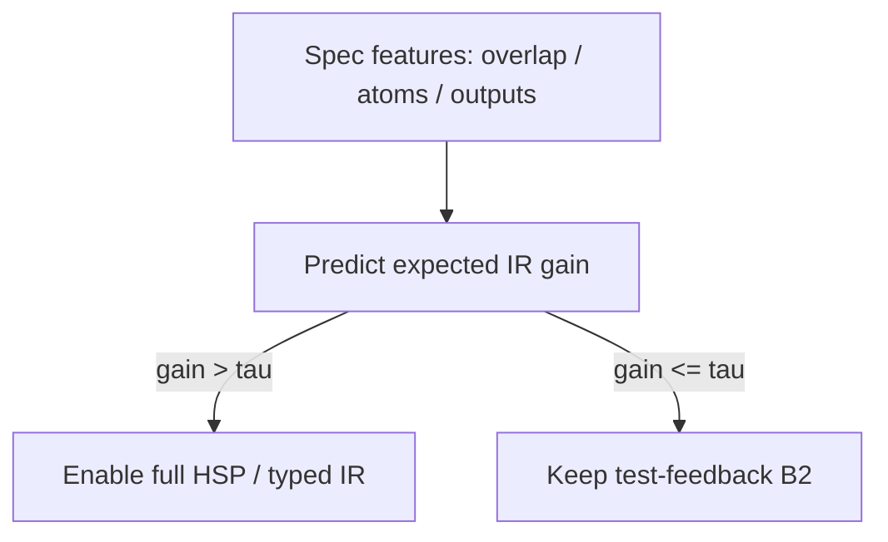

# Deployment Predictor Report (Agent F)

## Question

Can we decide **before** running HSP whether typed Semantic Feedback IR is worth enabling?

## Data

- n=120 hard tasks with E6 labels
- positive IR wins=14
- deltas >5pp=14

## Metrics

```json
{
  "n": 120,
  "positive_wins": 14,
  "positive_gain5pp": 14,
  "win_classifier": {
    "cv_accuracy_mean": 0.6083,
    "cv_accuracy_std": 0.1074,
    "cv_f1_mean": 0.2551,
    "auc": 0.5098,
    "coefs": {
      "overlap_rate": -0.5624,
      "n_guard_atoms": -0.0488,
      "n_and_ops": -0.0488,
      "n_rel_ops": -0.0488,
      "mean_atoms_per_guard": -0.0503,
      "max_atoms_per_guard": 0.0,
      "prompt_spec_len": -0.2593,
      "n_outputs": 0.0,
      "n_inputs": 0.0,
      "n_scenarios": 0.0
    }
  },
  "delta_regressor": {
    "cv_mae": 0.1898,
    "cv_rmse": 0.332,
    "baseline_mae_predict_zero": 0.1247,
    "coefs": {
      "overlap_rate": -0.0532,
      "n_guard_atoms": -0.0106,
      "n_and_ops": -0.0106,
      "n_rel_ops": -0.0106,
      "mean_atoms_per_guard": -0.0116,
      "max_atoms_per_guard": 0.0,
      "prompt_spec_len": -0.0182,
      "n_outputs": 0.0,
      "n_inputs": 0.0,
      "n_scenarios": 0.0
    }
  },
  "policies": [
    {
      "tau": 0.0,
      "frac_choose_m": 0.8833,
      "mean_realized_delta": 0.0774,
      "mean_always_m": 0.0774,
      "mean_always_b2": 0.0,
      "regret_vs_always_m": 0.0
    },
    {
      "tau": 0.02,
      "frac_choose_m": 0.8333,
      "mean_realized_delta": 0.0674,
      "mean_always_m": 0.0774,
      "mean_always_b2": 0.0,
      "regret_vs_always_m": 0.0101
    },
    {
      "tau": 0.05,
      "frac_choose_m": 0.6833,
      "mean_realized_delta": 0.0601,
      "mean_always_m": 0.0774,
      "mean_always_b2": 0.0,
      "regret_vs_always_m": 0.0174
    },
    {
      "tau": 0.08,
      "frac_choose_m": 0.4833,
      "mean_realized_delta": 0.0222,
      "mean_always_m": 0.0774,
      "mean_always_b2": 0.0,
      "regret_vs_always_m": 0.0552
    }
  ]
}
```

## Interpretable tier rule

```json
[
  {
    "tier": "high",
    "n": 38,
    "mean_delta": 0.0921,
    "recommend": "prefer_inspect_M"
  },
  {
    "tier": "low",
    "n": 48,
    "mean_delta": 0.105,
    "recommend": "prefer_inspect_M"
  },
  {
    "tier": "medium",
    "n": 34,
    "mean_delta": 0.0221,
    "recommend": "default_B2"
  }
]
```

## Decision sketch



## Honest reading

If CV AUC/F1 is near chance, say so: deployment-aware then rests on **release requirements** (Accept/FAR) plus coarse tier rules, not a high-accuracy classifier.
If ridge MAE beats predict-zero, there is usable ranking signal for expected gain.

## Files

- `cv_metrics.json`
- `deployment_rules.json`
- `deployment_tree_rules.txt`
- `feature_importances.json`
