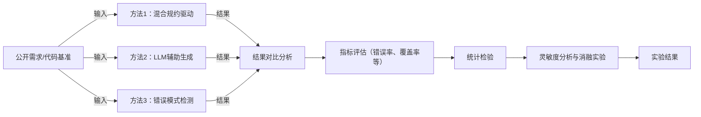

# 执行摘要

本报告基于刘少英教授的敏捷形式化软件工程思想，提出三种可验证、可实现的新型“错误防止”方法。首先，分析形式化软件工程及错误防止的背景，指出现有方法（如Cleanroom、基于SOFL的需求错误防止等）对文档和模型驱动方式的依赖以及敏捷开发的不足。研究目标是设计能嵌入敏捷流程的形式化防错方法，通过**混合规约驱动开发、LLM辅助代码生成与验证、错误模式知识库自动检测**等技术，显著降低需求与实现阶段的缺陷率。可衡量指标包括错误率、证明/验证覆盖率、自动化程度、性能开销和可扩展性等（阈值未指定，暂列为“未指定”）。报告详细设计了三种候选方法，并给出实验与验证方案（包括基准数据集、错误注入策略、对照方法、统计检验、灵敏度及消融分析等），以及面向开发实施的任务清单（模块划分、接口规范、伪代码、测试用例、CI流程等）。最后列出主要风险与应对策略，并对预期成果及发表方向（优先CCF-B/C会议/期刊）做出评估和规划。报告中给出方法架构流程图和对比表格，方便直观理解和后续实现。

## 研究背景与动机

形式化软件工程以严格的数学规约语言和验证技术来描述、分析和开发软件，已被证明能在早期发现和消除需求与设计阶段的歧义、矛盾和错误。例如，Cleanroom方法采用形式化证明，力图在开发初期预防缺陷。然而，传统形式化方法多依赖大量文档和冗长的证明过程，难以与市场快速变化和敏捷开发需求兼容。目前业界仍倾向“发现-修复”错误，导致成本高昂，研究界也多聚焦于测试和验证，而系统性的错误预防技术研究较少。

华东师范大学刘少英教授提出的Agile-SOFL（敏捷SOFL）方法尝试融合混合规约和敏捷开发，实现软件生产效率和质量的平衡。其研究方向包括利用**混合式规约驱动开发，构建过程防止客户需求相关错误**，以及**强化测试和复审环节以纠正错误**。在刘教授团队的规划中，采用“三步曲”技术（从无到有、从少到多、从粗到细、从抽象到具体）构建可追踪的混合规约过程，在每个阶段防止错误；利用大语言模型（LLM）自动从规约生成代码，并结合复审测试保证正确性；建立错误模式知识库，对静态检查可发现的错误模式进行总结并自动排查。尽管已有上述探索，但落地可验证的错误防止系统仍较少，尤其需要兼顾敏捷特性和形式化保证。

因此，本研究旨在基于刘少英教授的已有成果，设计多种新的错误防止方法，充分利用**混合式规约**、**人工智能**和**形式化验证**等技术，弥补现有方法对演化需求和大规模系统的适应不足。通过早期错误预防和自动化检查，降低后期修改成本，提高软件可信度。相关待检索文献示例包括：李鉴东等（2022）提出的基于SOFL的需求错误防止机制、李鉴东等（2019）提出的三步混合规约构建方法等。

## 研究目标与可衡量指标

- **研究问题**：如何在**敏捷形式化开发**过程中，通过形式化技术有效地预防需求和实现阶段的错误？目标是在保持开发效率的同时，显著降低软件缺陷率，特别是需求相关的错误和实现偏差。
- **预期贡献**：提出至少三种新的错误防止方法框架，每种方法都包含可验证的形式化模型、自动化实现方案，并通过实验评估显示有效性。工作成果应能以CCF-C/B级别发表，并为实际项目提供工具支持。
- **评价指标**：主要采用以下指标衡量方法效果：
  - **错误率（Error Rate）**：新方法下的缺陷率与基线（传统敏捷或仅测试）比较降低比例。目标阈值：未指定，可设想至少**降低>30%**（具体待实验确定）。
  - **验证/证明覆盖率（Proof/Verification Coverage）**：形式化检查覆盖的需求或代码比例。目标阈值：未指定（理想接近100%覆盖关键逻辑）。
  - **自动化程度**：开发过程中自动化完成的任务占总任务比例（如规格生成、代码验证、测试生成等）。目标值：未指定（期望尽量高，>70%）。
  - **性能开销**：方法引入的计算成本，如运行时间和资源消耗。目标阈值：未指定（需保证可接受，比如自动校验时间在数分钟级别）。
  - **可扩展性**：方法对系统规模（功能数量、模块复杂度）的适应能力，评估方法在规模增长时的效率衰减情况。
  - **用户体验**：若需要，可定性评估开发者对工具的易用性和学习成本。
- **基线与目标**：基线可选用一般敏捷开发＋传统测试（无形式化）和纯形式化开发（如Z/B方法）。新方法应优于基线的错误率和覆盖率表现，同时尽量减少额外成本。具体阈值若无先例设定，则报告中标记为“未指定”，可提出合理猜想或留待实验确定。相关基准可参考软件可靠性研究中的错误率评估方法。

## 候选方法设计

基于以上目标，设计以下三种具体可实现的错误防止方法。每种方法都结合了形式化规范和敏捷实践，并支持灵敏度分析与消融实验。

- **方法1：混合规约驱动的错误防止（Hybrid Spec-Driven Prevention）**  
  - **理论基础**：基于规范驱动的敏捷开发模型，扩展“三步混合规约”思想。利用形式化混合规约（GUI设计 + 半形式化 + 形式化）逐步细化需求，并在每步进行一致性和完备性检查，防止需求理解偏差。  
  - **关键技术路线**：首先通过Agile-SOFL编辑器构建**半形式化规格**和**GUI原型**描述，以确保需求清晰；然后在此基础上编写**形式化规格**（例如SOFL谓词逻辑模块），并用自动化工具（如Z3、Alloy、Event-B）进行规则一致性验证。利用模型检验捕捉潜在矛盾或遗漏（如不可达事件、不一致约束）。每个阶段对文档和实现进行交叉验证。  
  - **形式化模型**：采用SOFL语言和谓词逻辑作为形式化层次，结合数据流图（CDFD）模型和GUI规约。可将部分关键操作用抽象状态机或AST-based模型表示以辅助自动验证。通过符号推导或模型检查证明重要属性（如不变量和后置条件）在规格与实现间保持一致。  
  - **预期优劣**：优点是**精确、可追溯**，从需求开始就对错误进行预防，符合SBAD（规范驱动敏捷开发）理念；缺点是对规格构建有学习成本、形式化证明工具配置复杂。该方法适用于需求变动频繁的系统，可在持续迭代中保持规格与实现同步。  
  - **可行性分析**：已有Agile-SOFL编辑器实现第一步，后续可扩展通过插件调用现有验证工具（如Alloy Analyzer、KLEE等）进行校验。可行性高，但需解决工具集成和用户界面友好性。  
  - **灵敏度/消融**：参数包括“混合规约细化深度”（如是否使用第三步形式化），可通过减少步骤数来测试对错误防止效果的影响。消融实验可以剔除某个验证环节（如去掉GUI规约或只使用半形式化）来评估各部分贡献。

- **方法2：LLM辅助的代码生成与形式化验证（LLM-Assisted Formal Generation）**  
  - **理论基础**：结合大型语言模型（如GPT-4）与形式化验证技术，自动从混合规约生成代码并保证符合规格。理论依托于自然语言处理与形式化验证相结合的新趋势。之前研究表明，可对自然语言查询和生成代码分别自动形式化，再验证它们的等价性，从而保证代码准确实现需求。  
  - **关键技术路线**：首先将混合规格（自然语言及形式化部分）转化为“语言描述+逻辑公式”的输入提示，通过LLM生成初始代码。然后自动化地将生成代码与对应规格分别转换为形式化陈述（如逻辑不变式），并用形式化验证器（如SMT求解器或Dafny）校验两者是否满足同一规范。若验证失败，则记录反例并重新迭代：反馈给LLM或修改提示，重新生成代码。整个过程形成闭环迭代，借助人机交互辅助提示优化。  
  - **形式化模型**：采用程序逻辑或Hoare三元组形式化代码语义，以及Agile-SOFL混合规约的谓词逻辑表达。利用 SMT/定理证明保证**代码实现的后置条件和不变量**与规约一致。对于无法证明的部分，可生成测试用例或进行符号执行，以寻找行为偏差。  
  - **预期优劣**：优点是能大幅提高编码效率，实现**从需求到代码的自动化**；缺点是LLM生成结果可能不稳定，需要良好的提示工程和验证回路来保证正确性。目前LLM对逻辑推理欠佳，但与形式化验证结合可以弥补其不足。此方法特别适用于重复性高、结构化明确的需求场景。  
  - **可行性分析**：商业LLM已可通过API调用，加上开源验证工具（如Z3、LLVM/KLEE、Dafny），系统可实现原型。工作量在于开发高效的提示策略和验证接口。只要建立良好的反馈循环，该方案技术风险可控。  
  - **灵敏度/消融**：可变参数包括LLM温度、提示内容长度等，测试不同参数对代码正确率的影响。消融实验可去除“形式化验证”环节，仅依赖LLM或仅依赖基本测试，评估每个环节的必要性和效用。

- **方法3：错误模式知识库与自动排查（Error-Pattern Knowledge Base）**  
  - **理论基础**：基于错误模式识别和静态分析，通过积累“常见错误知识”来主动预防。灵感来自软件复审技术和经验总结，以及Agile-SOFL研究中建立错误知识库的思路。假设大多数错误归结为有限几类模式（如遗漏边界检查、未实现状态转换等），可将其形式化为反例模板，用于自动检查。  
  - **关键技术路线**：首先定义一组常见错误模式（基于先前项目失败案例和领域知识），并用形式化表达描述这些模式（例如以谓词、代码模式或OCL约束表示）。然后在开发过程中，通过静态分析工具（如PMD、Checkstyle扩展）扫描实现代码和规格，对照这些模式进行匹配，自动报告潜在错误。同时，在软件开发过程中**故意注入变异错误**（如插入错误变量、乱序语句等）来帮助开发者进行自我测试和定位。  
  - **形式化模型**：错误模式可形式化为逻辑谓词或状态机非法转移等形式。例如，规格中若要求变量**x>0**而实现没有检查，则可视为违反模式“未验证前置条件”。利用静态分析或模型检查（如有限域模型）捕获此类违例。对于运行时错误，可集成断言监控。  
  - **预期优劣**：优点是可以快速定位已知类别的错误、减轻人工审查负担；缺点是新颖错误模式可能遗漏，构建完整知识库前期成本高。此方法适合长期项目积累经验，对安全、稳定性有较高要求的领域效果最佳。  
  - **可行性分析**：现有静态分析框架易于扩展自定义规则，可实现快速原型。构建知识库需结合领域专家和历史缺陷数据，也可用机器学习自动挖掘模式。总体而言，该方法可行性中等，难点在于错误模式建模和动态更新。  
  - **灵敏度/消融**：可测试知识库规模（规则数量）对检测率的影响；消融实验可以依次移除部分模式或注入机制，评估各部分对错误发现的贡献。

上述三种方法可互为补充：例如方法1中的混合规约可产出结构化需求信息，为方法2和方法3提供基础；方法2生成的代码经过方法3检测进一步加强保证。在具体实施中，可探索将这些方法集成到敏捷开发流水线中（如将形式化验证作为CI流程的一部分），并与已有Agile-SOFL编辑器协同使用。表1总结了各候选方法在创新点、实现难度、验证难度、预期影响和适用场景等方面的比较。

| 比较维度       | 方法1：混合规约驱动防错             | 方法2：LLM辅助自动化验证            | 方法3：错误模式库自动排查            |
| -------------- | ------------------------------- | --------------------------------- | ------------------------------- |
| **创新点**     | 将“三步混合规约”与敏捷结合，实现从需求到实现的形式化一体化 | 将LLM代码生成与形式化验证结合，实现“需求→规约→代码”的闭环验证 | 构建形式化错误模式知识库，辅以自动化注入+静态分析，实现持续错误防御 |
| **实现难度**   | 中等偏高：需实现混合规约编辑器并集成验证工具 | 高：需要设计高质量提示、调用LLM和自动验证 | 中等：依托现有静态分析工具，但需丰富错误模式库 |
| **验证难度**   | 中等：可用现有模型检查工具逐步验证规格      | 高：需自动化证明代码符合规格，当前技术仍较新 | 中等：只需匹配已知模式，验证工作量较小         |
| **预期影响**   | 高：直接降低需求错误，适用于安全关键系统      | 高：显著提升开发效率和正确性，适用于结构化需求   | 中等：提升开发质量，可快速减小已知错误比例      |
| **适用场景**   | 对需求复杂且频繁变更的软件系统               | 有明确功能描述且可自动生成代码的场景          | 累积经验较丰富、关注稳定性和安全性的项目       |

## 实验与验证计划

为评估上述方法的有效性，拟设计以下实验流程：

- **数据集/基准**：选取公开的规范与实例项目作为实验对象。可使用相关领域的标准案例（如火车信号控制、自动柜员机、医疗管理系统等）及教学规范示例；如已有Agile-SOFL示例工程、开源大赛任务等。**未指定**的任务可灵活替换。所选基准需包含真实需求和代码。  
- **错误注入策略**：在基准项目中人为插入各类错误，用于测试方法的缺陷捕获能力。注入策略包括（1）*需求层面*：在原需求或规格中故意遗漏或歧义某些条件；（2）*实现层面*：向代码插入典型缺陷（如边界条件错误、错误条件跳转），或使用变异测试技术（Mutation Testing）生成程序变体作为错误版本。  
- **对比方法**：设置如下对照组：传统敏捷开发流程（无需形式化，仅依赖测试和审查）；纯形式化开发（例如先用Z/B完整规约再生成代码）；已有SOFL错误防止策略（如李鉴东2022年方法）。通过比较可量化各方法优劣。  
- **评价指标**：使用前述错误率、验证覆盖率、自动化程度、运行开销等指标。统计各方法在一定用例集上的缺陷检出率和剩余错误率；对形式化验证部分衡量覆盖的逻辑分支和路径比例；记录自动化比例和运行时间（CPU 时间、内存占用）。  
- **统计显著性检验**：对多次实验结果计算均值和方差，使用t检验或Wilcoxon秩和检验等方法评估各方法差异的统计显著性，以保证结论可靠。  
- **灵敏度分析**：针对每种方法，系统地改变关键参数。例如在方法2中改变LLM的输出数量或验证次数，在方法3中改变知识库规模，在方法1中改变规约细化深度。观察指标随参数变化趋势，绘制灵敏度曲线，分析系统稳健性。  
- **消融实验**：分别去除每种方法的核心组件，例如“去掉形式化验证”、“去掉LLM辅助”、“去掉错误注入”，比较去除前后的性能差异。这样可量化各组件对整体效果的贡献。  
- **实现细节**：开发语言建议使用Python或Java。可利用Agile-SOFL编辑器（第一个任务成果），LLM接入OpenAI API或本地模型，形式化验证借助Z3/Alloy/Dafny等，静态分析可用PMD/SpotBugs等工具。  
- **开源基准与工具**：可参考国内外开源规格案例库（如ZBench、VDM-SL示例集），公开项目如[SOLL](https://github.com)上的表单系统等；工具方面使用官方文档齐全的开源项目，如Spin、Alloy Analyzer、OpenAI GPT-4 API 等。优先选择有**中文文档或官方支持**的软件和资源，以便团队使用。  
- **资源与时间表**：实验在普通服务器或云平台进行（建议至少8核CPU、16GB内存的环境，LLM调用可使用GPU云服务以加速）。初步时间计划：第1-2月完成各方法原型开发；3-4月运行实验并收集数据；5月进行结果分析和验证；6月编写技术报告和准备投稿。实验流程如图1所示。



*图1. 错误防止方法的实验流程示意图。*

## 实现交付清单

为便于将方案直接交付给开发实现（如使用Cursor辅助编码），需明确划分任务模块、接口和交付内容：

- **模块划分**：
  - *规范编辑模块*：扩展Agile-SOFL编辑器，支持混合规约的交互式构建，输出结构化数据（如JSON或XML格式的半形式化和形式化元素）。
  - *错误模式库模块*：定义错误模式的表达方式（可采用DSL或逻辑谓词），提供添加、查询和匹配接口；实现静态分析引擎，遍历代码/规约以查找模式匹配实例。
  - *LLM接口模块*：封装与大语言模型的通信，提供提示生成器和结果解析。接口定义为`generate_code(spec)`，返回候选代码片段，并记录提示及响应日志。
  - *形式化验证模块*：对代码和规约分别进行形式化表示，并调用验证器。接口如`verify_equivalence(spec_formal, code_formal)`，返回验证结果（通过/失败及反例）。可使用Z3、Dafny、Alloy等库作为后端。
  - *测试生成与注入模块*：根据注入策略自动在原规格或代码中插入错误，生成带缺陷的测试用例；接口如`inject_errors(input, patterns)`返回错误版本集。
  - *结果分析模块*：收集各模块输出指标，进行统计计算和报告生成。
- **接口和伪代码示例**：
  - 规范编辑模块输出格式示例（JSON）：  
    ```json
    {
      "spec": {
        "GUI": {...},
        "SemiFormal": [...],
        "Formal": {...}
      }
    }
    ```
  - 错误模式匹配伪代码：  
    ```pseudo
    for each (pattern in ErrorPatternDB):
        if pattern.matches(codeSegment):
            report(pattern, location)
    ```
  - LLM调用伪代码：  
    ```pseudo
    prompt = generatePrompt(specification)
    code = GPT4.generate(prompt)
    if verify_equivalence(formal_spec, formalize(code)):
        accept(code)
    else:
        revise(prompt, feedback)
    ```
- **测试用例**：为每模块编写单元测试。如规范编辑器输出有效混合规约结构；错误模式库能识别常见错误；LLM接口在断网模拟时有优雅错误；验证模块对简单命题（如x>0）可检测一致性等。
- **持续集成（CI）流程**：使用GitHub Actions或类似工具，每次提交自动运行单元测试和代码风格检查。CI应支持Docker环境构建，以保证依赖稳定。 
- **复现实验脚本**：准备可重复运行的实验脚本，记录随机种子和参数配置。建议使用容器（如Docker Compose）封装环境（包含Agile-SOFL编辑器、验证器、LLM接口等），并提供README说明实验步骤。

上述模块及任务清单可转化为具体的开发指令，确保构件之间接口清晰、测试覆盖全面，以便Cursor等自动化工具快速上手实现与调试。

## 风险与应对

- **风险1：LLM输出不稳定**。LLM可能生成与需求不一致或含糊的代码。*缓解*：设计**重试和反馈机制**，如多次生成和形式化验证结合；如果连续失败，则人工干预；使用较大模型或专用微调模型提升质量。  
- **风险2：形式化验证规模化难题**。复杂系统的完全验证开销巨大。*缓解*：采用**增量验证**策略，对关键模块优先验证；使用抽象和约束削减状态空间；结合测试（TBFV）验证不可证明部分。  
- **风险3：错误模式库不完备**。知识库初期只覆盖常见错误，可能漏报。*缓解*：定期更新库，引入**学习机制**（例如根据实际缺陷补充新模式）；提供定性统计衡量已覆盖错误比例。  
- **风险4：工具集成复杂**。多种工具（验证器、LLM、编辑器）组合存在兼容性问题。*缓解*：采用容器化（Docker）统一环境，接口使用标准协议（JSON/REST）；逐步集成测试确保稳定。  
- **风险5：基准数据不足或不代表性**。实验用例覆盖面不够。*缓解*：使用**多样化基准**（不同领域、规模的示例），并对结果适当保留假设界限；如果可能，邀请领域专家评审准确性。  

## 预期成果与发表策略

针对不同候选方法及研究阶段，建议如下成果和发表规划：

- **候选方法1（混合规约驱动）**：可目标CCF-B类软件工程会议/期刊，如**中国软件大会(软件工程方向)、软件学报(CCF-A)**、**QRS/ICFEM**（国际会议）等，侧重理论创新和实验验证，时间线在原型成熟后6个月内投稿。若方法效果显著，可进一步深入发表于CSSE等期刊。  
- **候选方法2（LLM辅助生成）**：属于AI+软件工程交叉领域，可投**ICSE/ASE**（CCF-A）、**软件学报**、**IEEE TSE**（CCF-A）等；初期可先在**CCF-C会议**如CASE、CACS（中国自动化学会），或国际CIT/ISSRE研讨会发布预研结果。预计原型开发后3-4个月内完成初步实验，然后择优会议投稿。  
- **候选方法3（错误模式库）**：适合软件质量与测试类会议，如**ICST/QRS/ICSE Workshops**、国内**软件学报/计算机研究与发展**。由于应用性强，也可考虑CCF-C级期刊**计算机工程与应用**。实施后3-4个月可形成初稿。  
- **时间线**：总体规划为一年内完成方法设计、实验验证与论文撰写。建议先行完成一个方法的原型并撰写CCF-C级会议论文作为阶段成果，然后逐步完善其他方法并瞄准高一级会议或期刊。若遇重大突破，可考虑联合投稿或扩展为长文提交。  

**参考文献待检索**：李鉴东等, 2022年, “Requirements-Related Fault Prevention Mechanism for SOFL Formal Specification-Based Programming”；李鉴东等, 2019年, “三步混合规约构建方法” (信息与软件技术)；（其余待检索并完善）等。

